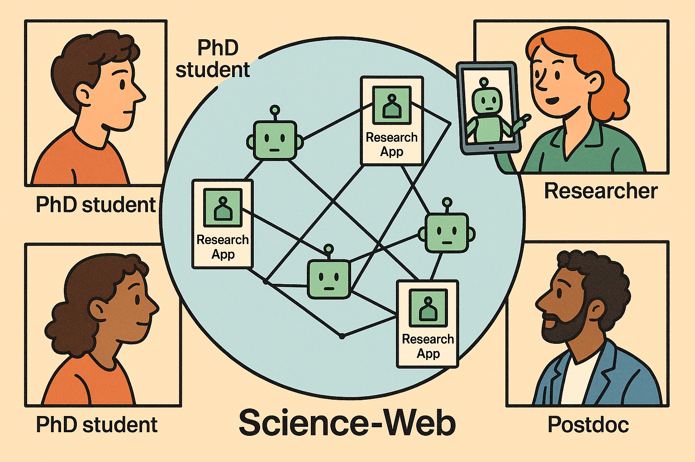

# 🔗 Project Pipeline: The Living Research Web

## 1. Concept Foundation
- **Vision**: Research as *living, executable apps* instead of static PDFs.  
- **Principles**: reproducibility, openness, permission control, collaboration.  
- **Stakeholders**: scientists, institutions, AI agents, industry partners.  

---

## 2. Core Infrastructure

### Research-as-Apps Framework
- Containerized code (e.g., Docker, Streamlit, Jupyter).  
- Metadata standards (author, DOI, license, dependencies).  
- APIs for app discovery and integration.  

### Permission & Licensing Layer
- Open / Restricted / Commercial modes.  
- Usage tracking dashboards.  
- Attribution & automatic citation mechanisms.  

---

## 3. Agent Integration
AI agents as collaborators:
- Search for relevant research-apps.  
- Request access to run methods.  
- Explore parameter spaces, generate variations.  
- Auto-acknowledge contributions.  

---

## 4. Researcher Workflow
1. Upload project → becomes an interactive app.  
2. Other scientists or AI agents discover it.  
3. With permission, they run or extend it.  
4. Results are shared, with attribution.  
5. Iterative cycle → *Living Research ecosystem*.  

---

## 5. Network Effect & Scaling
- Global research landscape maps built by AI.  
- Interdisciplinary pipelines assembled in real time.  
- **Metrics**: number of runs, extensions, collaborations formed.  

---

## 6. Impact & Culture Change
- **Faster science** → no reimplementation bottleneck.  
- **More collaboration** → across labs and disciplines.  
- **Measurable impact** → transparent usage metrics.  
- **Cultural shift** → science becomes alive, networked, and interactive.  

